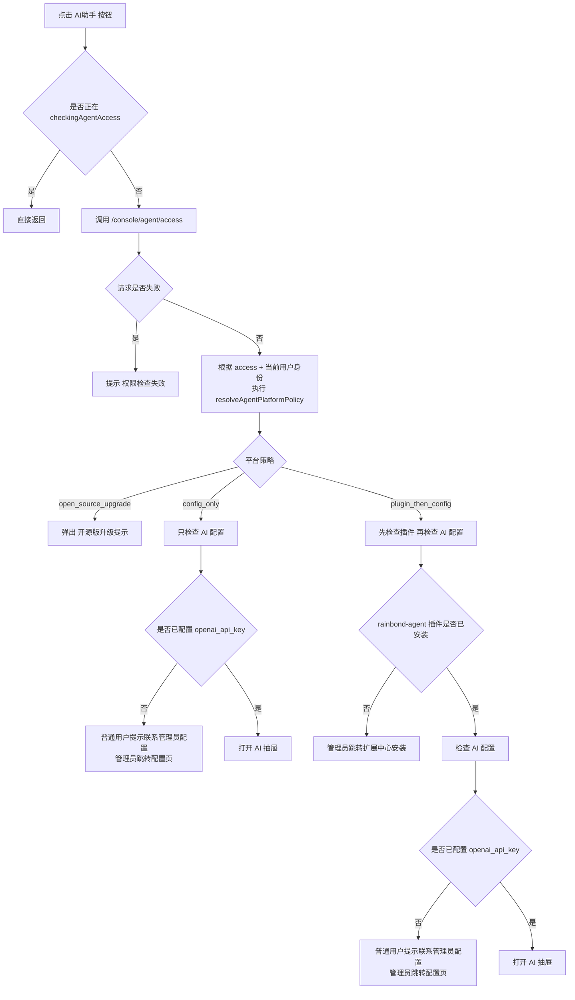

# GlobalHeader AI 助手判断逻辑

本文档说明 `rainbond-ui/src/components/GlobalHeader/index.js` 中 AI 助手入口的显示与点击判断逻辑，方便后续排查和调整。

## 一、入口是否显示

Header 中 `AI助手` 按钮是否渲染，先看总开关和当前页面状态。

对应代码：

- `isRainbondInfoAgentEnabled`
- `agentVisible`
- `isAgentRouteHidden`

实际判断：

```js
const showAgentLauncher =
  isRainbondInfoAgentEnabled(rainbondInfo) &&
  !agentVisible &&
  !isAgentRouteHidden();
```

含义：

- `isRainbondInfoAgentEnabled(rainbondInfo)`  
  平台总开关。若 `rainbondInfo.show_ai_assistant.enable === false`，则整个入口直接隐藏。
- `!agentVisible`  
  AI 抽屉已经打开时，不再显示 Header 按钮。
- `!isAgentRouteHidden()`  
  某些页面禁止显示入口，例如 `/user`、`/oauth`、webconsole 等。

## 二、整体判断流程

点击 `AI助手` 按钮后，整体判断流程如下：



## 三、平台策略判断

平台策略由 `agentLauncherAction.js` 中的 `resolveAgentPlatformPolicy()` 决定。

### 1. 开源版

判断条件：

- `access.edition === 'open_source'`
- 或 `access.is_open_source === true`

行为：

- 如果当前用户是企业管理员，并且 `access.is_initial_enterprise_admin === true`
  返回 `plugin_then_config`
- 其他所有用户
  返回 `open_source_upgrade`

这意味着：

- 开源版只有“首位企业管理员”允许继续使用 AI 助手
- 其他企业管理员也不允许直接用
- 普通用户也不允许直接用
- 不允许的用户统一弹出“了解企业版”提示

### 2. 企业版

行为：

- 企业管理员：返回 `plugin_then_config`
- 普通用户：返回 `config_only`

这意味着：

- 企业版管理员需要负责安装插件和完成配置
- 企业版普通用户不参与插件安装判断，只关心当前企业是否已经完成配置

## 四、插件判断

当平台策略是 `plugin_then_config` 时，进入插件判断。

对应函数：

- `fetchAgentPluginStatus()`
- `resolveAgentLauncherAction()`

插件状态判断结果：

- `installed` -> 继续检查 AI 配置
- `missing` -> 管理员弹窗并跳转 `/enterprise/:eid/extension`
- `error` -> 提示插件状态获取失败
- `pending` -> 提示正在检查插件状态

这里主要检查的插件是：

- `rainbond-agent`

## 五、配置判断

无论是 `config_only` 还是 `plugin_then_config`，只要进入配置判断，都会调用：

- `global/fetchAgentLlmConfig`
- 接口：`/console/enterprise/:eid/agent-llm-config`

当前关键判断字段：

- `config.openai_api_key_set`

结果：

- `false`
  走 `handleMissingAgentApiKey()`
- `true`
  执行 `dispatch({ type: 'agent/show' })`

### 未配置时的行为

`handleMissingAgentApiKey()` 的分支如下：

- 企业管理员  
  弹出确认框，确认后跳转 `/enterprise/:eid/ai/agent-config`
- 普通用户  
  弹出提示框，提示联系企业管理员完成配置

## 六、角色与平台对照表

| 平台 | 用户身份 | 是否首位企业管理员 | 是否查插件 | 是否查配置 | 最终行为 |
|------|----------|--------------------|-----------|-----------|----------|
| 开源版 | 普通用户 | 否 | 否 | 否 | 直接弹出升级提示 |
| 开源版 | 企业管理员 | 否 | 否 | 否 | 直接弹出升级提示 |
| 开源版 | 企业管理员 | 是 | 是 | 是 | 未安装去安装，未配置去配置，配置完成可打开 |
| 企业版 | 普通用户 | 无关 | 否 | 是 | 未配置提示联系管理员，已配置可打开 |
| 企业版 | 企业管理员 | 无关 | 是 | 是 | 未安装去安装，未配置去配置，配置完成可打开 |

## 七、关键代码位置

- 入口总开关：
  `rainbond-ui/src/utils/agentVisibility.js`
- Header 渲染与点击逻辑：
  `rainbond-ui/src/components/GlobalHeader/index.js`
- 平台策略和插件动作判断：
  `rainbond-ui/src/components/GlobalHeader/agentLauncherAction.js`
- 权限接口：
  `rainbond-console/console/views/agent_access.py`
- 权限服务：
  `rainbond-console/console/services/agent_access_service.py`
- AI 配置接口：
  `rainbond-console/console/views/agent_llm_config.py`

## 八、实现备注

当前实现里：

- `isRainbondInfoAgentEnabled` 只负责“入口总开关”
- “能不能看到按钮”和“点了以后能不能真正打开”是两层逻辑
- 开源版是否允许使用，不仅看 `is_enterprise_admin`，还必须看 `agent/access` 返回的 `is_initial_enterprise_admin`
